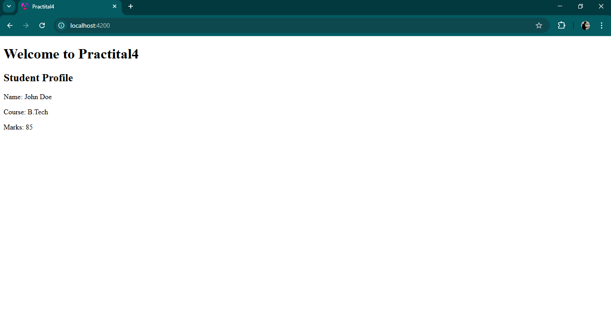

# Practical 4: Angular Directives

This project was generated using [Angular CLI](https://github.com/angular/angular-cli) version 19.2.15.

## Practical Exercise: Angular Directives

**Aim:** To study CLI commands, structural directives, attribute directives, and custom directives.

### 1. Component Generation
- **Command:** `ng generate component student-profile`
- **Description:** Created a component to display a student’s details (name, course, marks) using data binding.

### 2. Structural Directive – ngIf
- **Component:** `login-status`
- **Description:** Uses `*ngIf` to display “Welcome, User!” if `isLoggedIn = true` and “Please log in” otherwise.

### 3. Structural Directive – ngFor
- **Component:** `product-list`
- **Description:** Displays a list of products using `*ngFor` in a `<ul>`. Highlights products with price > 1000 using CSS.

### 4. Attribute Directive – ngStyle & ngClass
- **Component:** `task-manager`
- **Description:** Displays a list of tasks where completed tasks appear in green and pending tasks in red using `ngStyle` or `ngClass`.

### 5. Custom Directive
- **Directive:** `highlightText`
- **Description:** A custom directive that changes text color on mouse hover. Applied on `<p>` tags to highlight product names in the `product-list` component.

## Screenshot



## Development server

To start a local development server, run:

```bash
ng serve
```

Once the server is running, open your browser and navigate to `http://localhost:4200/`. The application will automatically reload whenever you modify any of the source files.

## Code scaffolding

Angular CLI includes powerful code scaffolding tools. To generate a new component, run:

```bash
ng generate component component-name
```

For a complete list of available schematics (such as `components`, `directives`, or `pipes`), run:

```bash
ng generate --help
```

## Building

To build the project run:

```bash
ng build
```

This will compile your project and store the build artifacts in the `dist/` directory. By default, the production build optimizes your application for performance and speed.

## Running unit tests

To execute unit tests with the [Karma](https://karma-runner.github.io) test runner, use the following command:

```bash
ng test
```

## Running end-to-end tests

For end-to-end (e2e) testing, run:

```bash
ng e2e
```

Angular CLI does not come with an end-to-end testing framework by default. You can choose one that suits your needs.

## Additional Resources

For more information on using the Angular CLI, including detailed command references, visit the [Angular CLI Overview and Command Reference](https://angular.dev/tools/cli) page.
